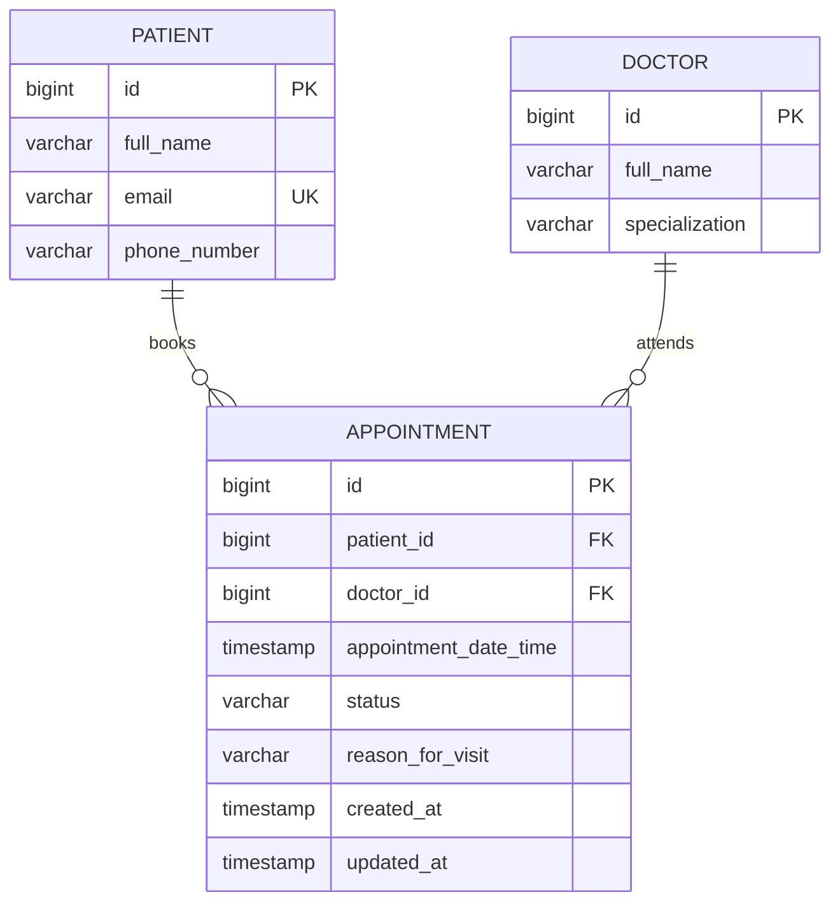
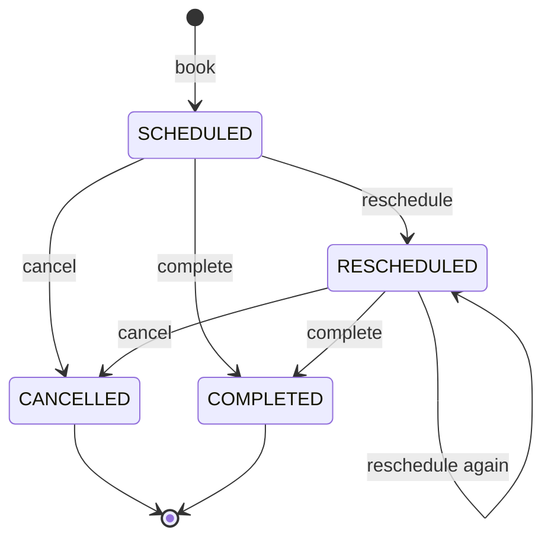

# Canonical Data Model — Hospital Appointment API

This document defines the single source of truth for how data is structured
across the Hospital Appointment API: entities, attributes, relationships,
constraints, and the rules that govern valid state. It should stay in sync
with `src/main/java/com/hospital/appointment/model/` — if the two ever
diverge, this document (or the code) needs updating.

## 1. Scope

The model currently covers three core entities:

- **Patient** — a person who can book appointments
- **Doctor** — a clinician who can be booked
- **Appointment** — a booking that links one patient to one doctor at a
  specific date/time, with a lifecycle status

This is intentionally minimal for the current API surface (book / cancel /
reschedule). Section 6 notes likely extensions as the system grows.

## 2. Entity-Relationship Diagram



**Cardinality in plain English:** one patient can have many appointments; one
doctor can have many appointments; each appointment belongs to exactly one
patient and exactly one doctor. There is no many-to-many relationship in the
current model.

## 3. Entities

### 3.1 Patient

| Attribute     | Type         | Constraints                          | Notes                                  |
|---------------|--------------|----------------------------------------|-----------------------------------------|
| `id`          | `BIGINT`     | PK, auto-generated (identity)          | Surrogate key                           |
| `fullName`    | `VARCHAR`    | NOT NULL                               |                                          |
| `email`       | `VARCHAR`    | NOT NULL, UNIQUE                       | Used as the natural identifier for lookup; validated as a proper email format |
| `phoneNumber` | `VARCHAR`    | NOT NULL, `@Pattern`-validated          | Accepts digits, spaces, `()`, `-`, and an optional leading `+`, 7–20 chars |
| `active`      | `BOOLEAN`    | NOT NULL, default `true`               | Soft-delete flag — see 5.2 |

**Relationships:** one `Patient` → many `Appointment` (`appointments`,
cascade `PERSIST` + `MERGE` only — no `REMOVE`/`orphanRemoval`). "Deleting" a
patient sets `active = false` rather than removing the row, so appointment
history is preserved (see 5.2).

### 3.2 Doctor

| Attribute        | Type      | Constraints        | Notes |
|-------------------|-----------|----------------------|-------|
| `id`              | `BIGINT`  | PK, auto-generated   | Surrogate key |
| `fullName`        | `VARCHAR` | NOT NULL             |       |
| `specialization`  | `VARCHAR` | NOT NULL             | Free-text today (e.g. "Cardiology"); a candidate for becoming a controlled vocabulary later — see 6.1 |
| `active`          | `BOOLEAN` | NOT NULL, default `true` | Soft-delete flag — see 5.2. Also checked when booking: an inactive doctor can't be booked for new appointments. |

**Relationships:** one `Doctor` → many `Appointment` (`appointments`, cascade
`PERSIST` + `MERGE` only — no `REMOVE`/`orphanRemoval`). "Deleting" a doctor
sets `active = false` rather than removing the row, so appointment history is
preserved (see 5.2).

### 3.3 Appointment

| Attribute               | Type          | Constraints                              | Notes |
|--------------------------|---------------|---------------------------------------------|-------|
| `id`                     | `BIGINT`      | PK, auto-generated                          | Surrogate key |
| `patient`                | FK → Patient  | NOT NULL, `ManyToOne`, lazy fetch           | `patient_id` column |
| `doctor`                 | FK → Doctor   | NOT NULL, `ManyToOne`, lazy fetch           | `doctor_id` column |
| `appointmentDateTime`    | `TIMESTAMP`   | NOT NULL, must be in the future on create/reschedule | Validated via `@Future` at the DTO layer, not the DB layer |
| `status`                 | `ENUM` (string)| NOT NULL, default `SCHEDULED`              | See 3.4 for the state machine |
| `reasonForVisit`         | `VARCHAR`     | nullable                                    | Free text |
| `createdAt`              | `TIMESTAMP`   | set once, immutable after insert            | Populated by `@PrePersist` |
| `updatedAt`              | `TIMESTAMP`   | updated on every write                      | Populated by `@PreUpdate` |

**Uniqueness rule enforced in the service layer (not yet at the DB level):**
a doctor cannot hold two non-cancelled appointments at the same
`appointmentDateTime`. See 5.1.

### 3.4 AppointmentStatus (enum)

```
SCHEDULED   → the default state after booking
CANCELLED   → terminal; the appointment no longer holds its time slot
RESCHEDULED → set after a successful reschedule; the appointment now points at a new appointmentDateTime
COMPLETED   → terminal; set via PATCH /api/appointments/{id}/complete once the visit has taken place
```

**Valid transitions today:**



Rescheduling or completing a `CANCELLED` appointment is explicitly rejected
(`InvalidAppointmentException`), as is completing an already-`COMPLETED` one.
Nothing currently transitions a `COMPLETED` appointment back to another
state — if a visit needs to be "un-completed," that would be a new decision
to make, not an existing code path.

## 4. Naming conventions

- **Java:** entities and fields use standard `UpperCamelCase` / `lowerCamelCase`.
- **Database columns:** Hibernate's default physical naming strategy converts
  camelCase to `snake_case` (e.g. `appointmentDateTime` → `appointment_date_time`,
  `patient` FK → `patient_id`). No custom `@Column(name=...)` overrides are in
  use, so the DB schema is fully derived from the entity field names.
- **Status values:** stored as the enum's name string (`EnumType.STRING`), not
  an ordinal — this is intentional so the DB stays readable and safe to
  reorder in code without corrupting stored data.

## 5. Constraints and integrity rules

### 5.1 Business rules enforced in the service layer

These are **not** enforced by database constraints today — they live in
`AppointmentServiceImpl`:

- A patient and doctor referenced by an appointment must already exist
  (`ResourceNotFoundException` otherwise).
- A doctor must be `active` to be booked for a new appointment.
- `appointmentDateTime` must be in the future (DTO-level `@Future` validation
  — bypassable if something writes directly via the repository).
- A doctor cannot have two non-cancelled appointments at the same timestamp
  (checked via `existsByDoctorIdAndAppointmentDateTimeAndStatusNot`, run
  inside a `SERIALIZABLE`-isolation transaction on both `bookAppointment`
  and `rescheduleAppointment` to close most of the concurrent-request race
  window described below). Under real contention this trades a small amount
  of throughput, and a losing transaction fails with a serialization error
  that the caller should be prepared to retry — it does not silently corrupt
  data, but it isn't free.
- Cancelling an already-cancelled appointment is rejected.
- Rescheduling a cancelled appointment is rejected.
- Completing a cancelled or already-completed appointment is rejected.

**Implication:** the canonical guarantees of this model currently depend on
every write going through the service layer. If another process writes to
the `appointments` table directly, none of the above is enforced. A true
DB-level constraint (a partial unique index on
`(doctor_id, appointment_date_time) WHERE status <> 'CANCELLED'`) would
close this permanently regardless of the caller, but requires a schema
migration tool (Flyway/Liquibase) rather than Hibernate's `ddl-auto=update`,
which can't express partial indexes — see 6.6.

### 5.2 Cascade behavior and soft delete

`Patient.appointments` and `Doctor.appointments` now cascade only `PERSIST`
and `MERGE` — `REMOVE`/`orphanRemoval` were removed. `deletePatient` and
`deleteDoctor` no longer call `repository.deleteById(...)`; instead they load
the entity, set `active = false`, and save it. This means:

- Appointment history is never destroyed by a "delete."
- `GET /api/patients` and `GET /api/doctors` return only `active = true`
  rows by default (`findByActiveTrue`), so deactivated records drop out of
  normal listings.
- `GET /api/patients/{id}` / `GET /api/doctors/{id}` still return an inactive
  record if looked up directly by id — appointments referencing it still
  need a name/id to display.
- There is currently no "reactivate" endpoint; flipping `active` back to
  `true` would need a direct DB update or a new endpoint if that's a real
  use case.

## 6. Known gaps / candidate extensions

Not implemented, but flagged because they're common next steps for a system
like this:

1. **Doctor specialization as a controlled vocabulary.** Today it's a free-text
   `VARCHAR`, so "Cardiology" and "cardiology" are different values with no
   normalization. A `Specialization` lookup table would fix this and support
   filtering doctors by specialty reliably. *(Not yet addressed.)*
2. **No `Address`/`DateOfBirth`/other demographic fields on `Patient`.** Kept
   minimal for the current API; extend if patient records need to support
   more than scheduling. *(Not yet addressed.)*
3. **No audit/history table.** Status changes and reschedules overwrite the
   row in place (`updatedAt` tracks *when*, but not *what changed* or *who
   changed it*). If you need a change history, add an `AppointmentHistory`
   entity capturing each transition. *(Not yet addressed.)*
4. **No "reactivate" path for a soft-deleted patient or doctor.** Once
   `active` is flipped to `false`, nothing in the API sets it back to `true`.
   *(Not yet addressed — noted in 5.2.)*
5. **No true DB-level constraint on (doctor_id, appointment_date_time)
   excluding cancelled rows.** `SERIALIZABLE` isolation (see 5.1) closes the
   practical race-condition window for concurrent requests through the
   service layer, but it's still not a constraint the database itself
   enforces — a direct write to the table bypasses it entirely. A partial
   unique index would close this permanently, but Hibernate's
   `ddl-auto=update` can't express one; it needs a migration tool
   (Flyway/Liquibase) writing raw DDL. *(Partially addressed at the
   application layer; full fix requires adopting a migration tool.)*

**Fixed in this revision:** phone number format validation, the
`COMPLETED` status transition, and soft-delete for `Patient`/`Doctor`
(previously: hard delete cascaded to destroy appointment history).

## 7. Physical schema summary (PostgreSQL)

Auto-generated by Hibernate (`ddl-auto=update`) from the entities above; shown
here for reference as of this API version.

```sql
CREATE TABLE patients (
    id            BIGSERIAL PRIMARY KEY,
    full_name     VARCHAR NOT NULL,
    email         VARCHAR NOT NULL UNIQUE,
    phone_number  VARCHAR NOT NULL,
    active        BOOLEAN NOT NULL DEFAULT TRUE
);

CREATE TABLE doctors (
    id              BIGSERIAL PRIMARY KEY,
    full_name       VARCHAR NOT NULL,
    specialization  VARCHAR NOT NULL,
    active          BOOLEAN NOT NULL DEFAULT TRUE
);

CREATE TABLE appointments (
    id                      BIGSERIAL PRIMARY KEY,
    patient_id              BIGINT NOT NULL REFERENCES patients(id),
    doctor_id               BIGINT NOT NULL REFERENCES doctors(id),
    appointment_date_time   TIMESTAMP NOT NULL,
    status                  VARCHAR NOT NULL,
    reason_for_visit        VARCHAR,
    created_at              TIMESTAMP NOT NULL,
    updated_at              TIMESTAMP
);
```
